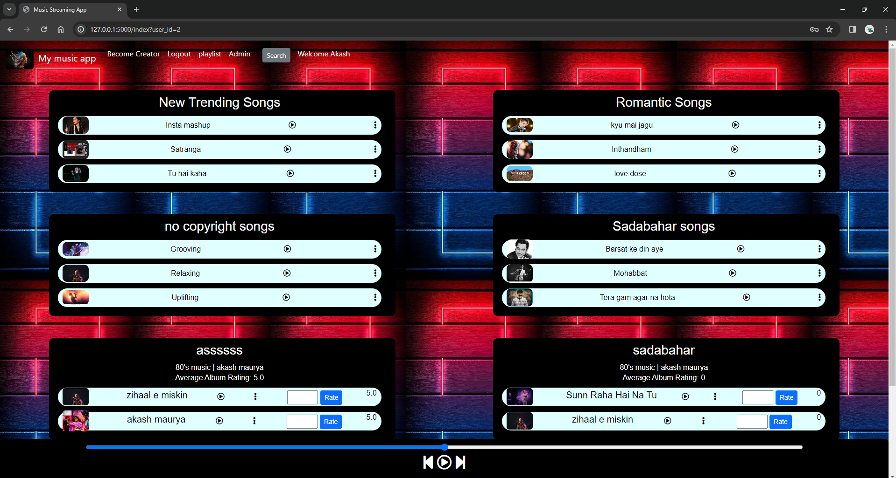
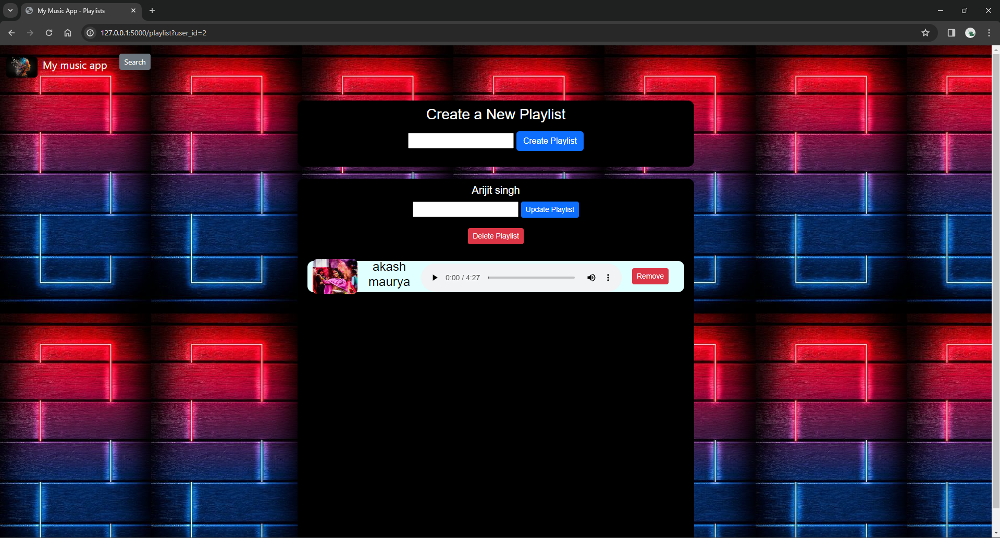
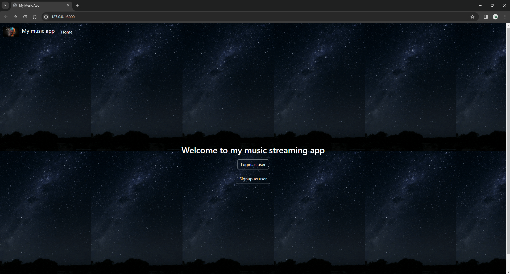

# music-streaming-app
A simple music application built with Flask, HTML, and SQLite, featuring roles for users, creators, and admins. Users can create playlists, search for songs, and rate or review music. Creators have permissions to add, update, and delete their songs. Admins have the authority to delete any album or song, and block users from the app if necessary.
## App Interface

### Homepage

### Playlist Creation

### Song Review and Rating

